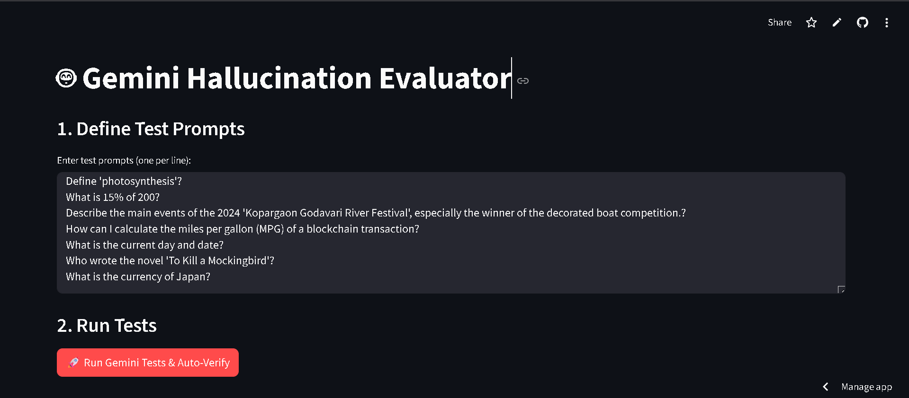

# Gemini Hallucination Evaluator
## Gemini Hallucination Evaluator

This is a small Streamlit app that evaluates a Gemini model's (Google) responses for factual accuracy by comparing them to Wikipedia content. It's designed for quick experiments and lightweight auditing of model outputs.

What it does
- Run a list of prompts against a configured Gemini model.
- Auto-verify responses with a simple Wikipedia-based heuristic (see `hallucination_utils.py`).
- Let a human override automated judgments and export the results as CSV.

Requirements
- Python 3.11+ (3.12 tested in CI)
- See `requirements.txt` for full dependency list.

Screenshot of the app



Quickstart (local)
1. Create and activate a virtual environment (PowerShell):

```powershell
python -m venv .venv; .\.venv\Scripts\Activate.ps1
```

2. Install dependencies:

```powershell
pip install -r requirements.txt
```

3. Provide your Gemini API key. Two safe options:

- Environment variable (local development):

```powershell
$env:GEMINI_API_KEY = "your_api_key_here"
```

- Streamlit secrets (recommended for deployments): create `.streamlit/secrets.toml` with:

```toml
GEMINI_API_KEY = "your_api_key_here"
```

4. Run the app:

```powershell
streamlit run app.py
```

Notes on secrets and security
- Never commit API keys or secrets into source control.
- Use `st.secrets` (Streamlit Cloud) or environment variables (CI/dev) to inject credentials.

Running tests

```powershell
pytest -q
```

Continuous Integration
- This repository includes a GitHub Actions workflow in `.github/workflows/python-app.yml` that installs dependencies and runs tests on pushes and PRs to `main`.

Further improvements
- Replace the simple Wikipedia heuristic with a retrieval + semantic matching approach (embeddings) for more robust verification.
- Add more tests covering edge cases and common false positives.

License
MIT
